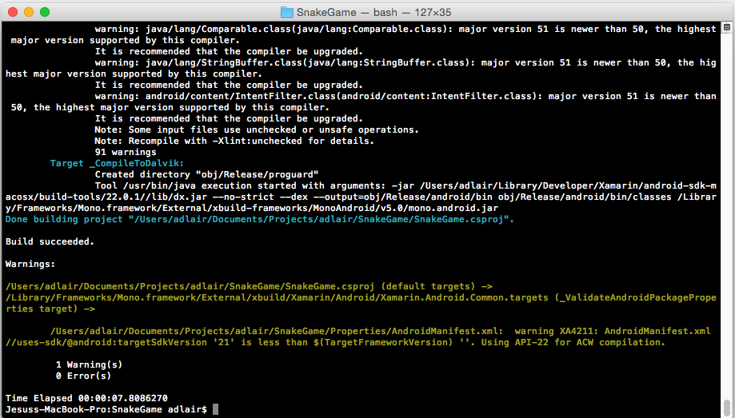
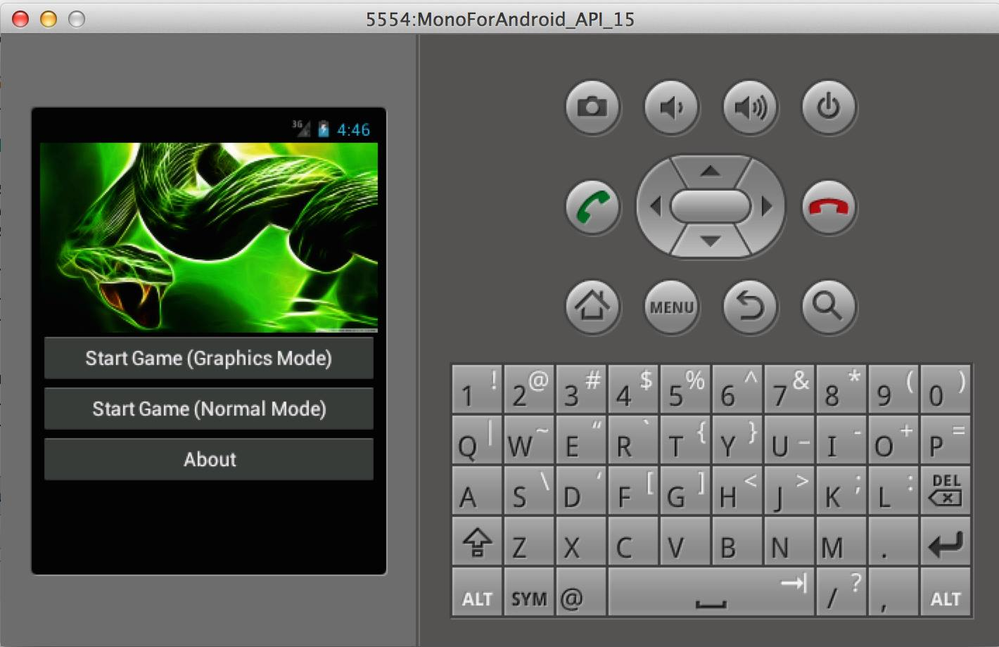
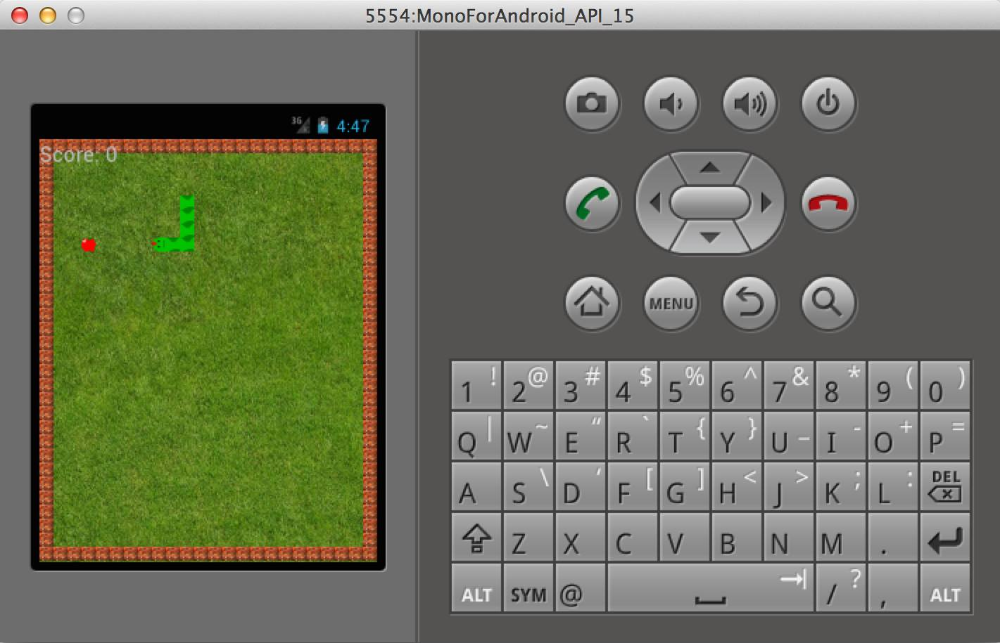
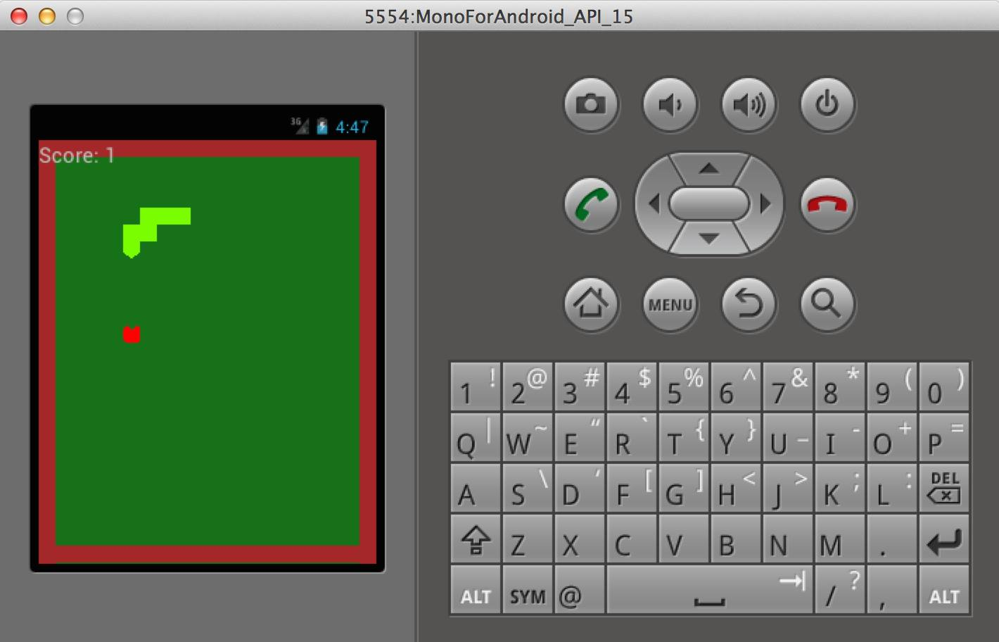
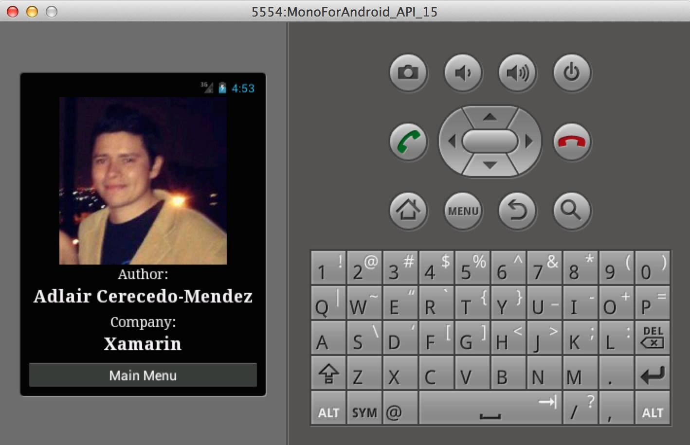

# SnakeGame

This is a sample game for you can understand how Xamarin for Android works. You can clone the repository, modify by yourself or contribute to make it better.

## Licence

You can read about the licence [here](Licence.md).

## Building the project

For a fast build, you only need to run:

```bash
make
```

If you get any problems trying to run it, you can clean the sources:

```bash
make clean
```

After that, run `make` again.

<p align="center">
  
</p>

## Screenshots

### Main view

<p align="center">
  
</p>

### Graphic mode

<p align="center">
  
</p>

### Normal mode

<p align="center">
  
</p>

### About

<p align="center">
  
</p>

## References

You can learn more about Xamarin and Mono for Android from the following resources:

* Xamarin
* Xamarin.Android
* MonoGame

## Contact

If you find an issue or have any questions, you can contact me at [adlair@libreoffice.org](mailto:adlair@libreoffice.org) or [adlair@linuxmail.org](mailto:adlair@linuxmail.org).

